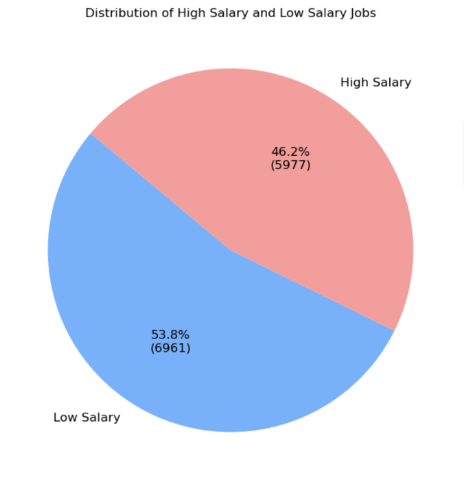
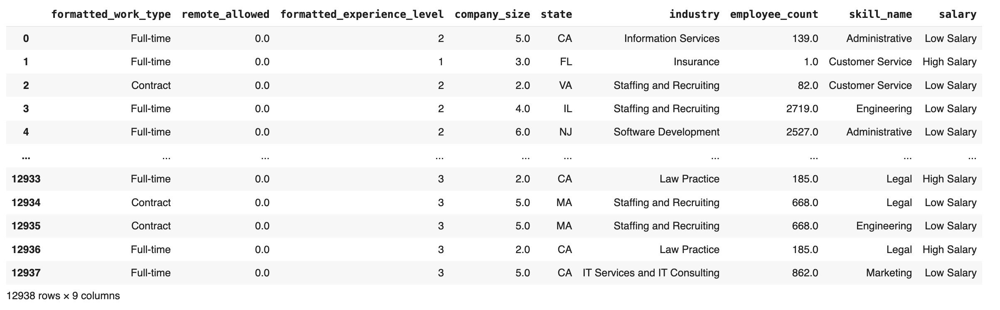

# 💼 Salary Classification from LinkedIn Job Postings

## Project Purpose  
This project aims to explore whether salary levels in job postings can be predicted using **machine learning** techniques. Using job posting data scraped from **LinkedIn**, the goal is to classify postings into **"High Salary"** or **"Low Salary"** categories, based on features like industry, work type, experience level, company size, and required skills. This analysis supports both **job seekers** and **employers** in making informed career and hiring decisions.

## Dataset Overview

- **Source**: [LinkedIn Job Postings (2023–2024)](https://www.kaggle.com/datasets/arshkon/linkedin-job-postings/data)
- The dataset includes **124,000+ job postings**
  
- **Target Variable**: Salary — "High Salary" vs "Low Salary"
  - The classification threshold was set at **$88,400**, which is the median value of the avg_salary column. Job postings with salaries above this threshold were labeled as "High Salary," while those below were labeled as "Low Salary.
- Data Cleaning:
  - Calculated average salary from min/max columns
  - Converted all salaries to yearly values
  - Removed outliers and missing values
  - Filtered to include **U.S. job postings only** (93% of jobs postings based in US)

### Class Distribution
- **High Salary**: 5,977 job postings 
- **Low Salary**: 6,961 job postings
  

  

### Data Dictionary
| Feature                     | Description |
|----------------------------|-------------|
| `formatted_work_type`      | Full-time, contract, or part-time - Dummy encoded categorical variables|
| `remote_allowed`           | Whether remote work is allowed (1 =Yes, 0 = No)|
| `formatted_experience_level` | Mapped to experience levels (Internship = 0, Entry level = 1,Associate = 2,Mid-Senior level = 3, Executive = 4, 'Director = 5) |
| `company_size`             | Grouped based on number of employees (0 smallest - 7 largest)|
| `state`                    | State of company headquarters (2- letters formatted)|
| `employee_count`           | Total employees at the company |
| `industry`                 | Industry that companies specialize - Dummy encoded categorical variables |
| `skill_name`               | Required skills for jobs - Dummy encoded categorical variables |
| `salary`                   | Binary class label (High/Low) |

  

## Methodology

### 1. Data Preprocessing
- Encoded categorical features
- Normalized class balance using **SMOTE**
- Split dataset using an 80-20 **holdout validation**
- Used **10-fold cross-validation** for evaluation consistency

### 2. Models Applied
- **Decision Tree Classifier**:
  - Evaluated unprocessed, pre-pruned, post-pruned, and SMOTE-enhanced versions
- **Random Forest Classifier**:
  - Baseline model, SMOTE version, and AdaBoost-enhanced ensemble

## Performance Summary

### Decision Tree Results

| Model Variant              | Accuracy (Test) | AUC Score |
|---------------------------|-----------------|-----------|
| No Preprocessing           | 0.77            | 0.79      |
| Pre-Pruning                | 0.77            | 0.82      |
| Post-Pruning               | 0.71            | 0.72      |
| SMOTE                      | 0.77            | **0.90**  |

> SMOTE improved both class balance and model performance, achieving the **highest AUC** of all decision tree models.

### Random Forest Results

| Model Variant              | Accuracy (Test) | AUC Score |
|---------------------------|-----------------|-----------|
| No Preprocessing           | 0.79            | 0.88      |
| AdaBoost                   | 0.76            | 0.84      |
| SMOTE + AdaBoost          | 0.78            | **0.85**  |

> Combining SMOTE and boosting led to the **most balanced performance**, solving overfitting while preserving high predictive power.

## Tech Stack
- **Python**:
  - `pandas` – Data manipulation and preprocessing  
  - `numpy` – Numerical operations  
  - `matplotlib`, `seaborn` – Data visualization  
  - `scikit-learn` – Machine learning models (Decision Tree, Random Forest, AdaBoost), model evaluation, and preprocessing  
  - `imblearn` – SMOTE for class balancing    
- **Google Colab** – Exploratory analysis and model development
- **CSV File Handling** – Reading, merging, and managing job posting datasets  

## Key Takeaways

- Models performed well in classifying job salary levels, with **Random Forest + SMOTE + Boosting** being the strongest.
- **Experience level**, **company size**, and **employee count** emerged as key predictive features.
- SMOTE enhanced model fairness by rebalancing the classes, improving performance on minority class ("High Salary") without significant trade-offs.
- Ensemble methods like **AdaBoost** helped reduce overfitting in complex models.

## Business Implications

- **For Job Seekers**: Understand how job characteristics relate to salary ranges and make informed application decisions.
- **For Employers**: Use insights to create competitive and targeted job postings aligned with market expectations.
- **For Recruiters & Analysts**: Implement similar classification models to monitor salary trends across industries and improve candidate targeting.

📎 [Explore the full script here](LinkedIn%20salary%20classification.py)

